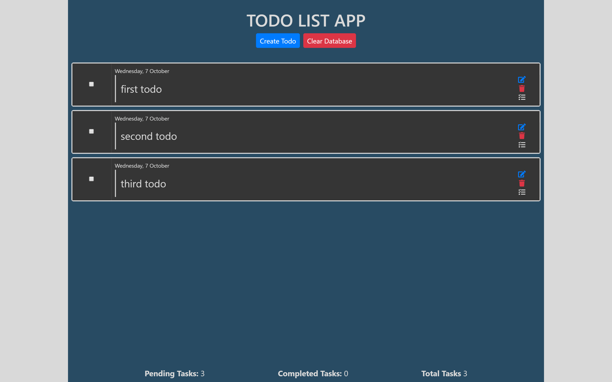
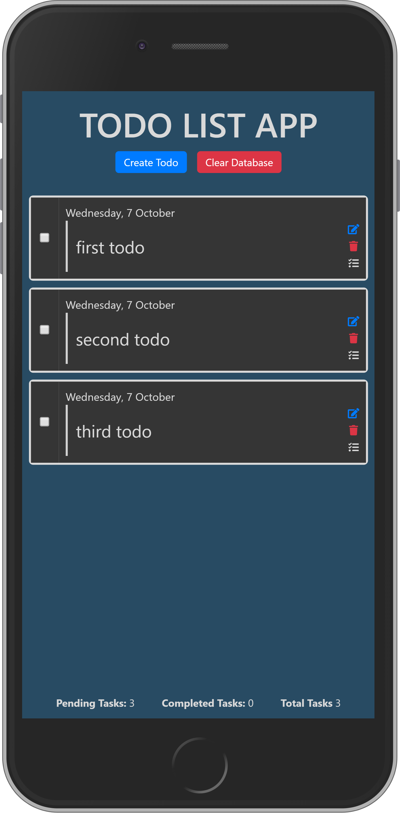

# todo_list webapp
A simple todo-list webapp - DevTask 2

This is the second project in the DevTask project series. The app is a simple todo app with editing and local storage capabilities. It is fully responsive on all screen sizes and built without any framework. 

## Screenshots

Desktop

Mobile

## Live Demo

[Hosted Link](https://tamsay-todo-app.netlify.app)

## Author

Longe Temitope
- Github: [@tamsay](https://github.com/tamsay)
- Twitter: [@longetope](https://twitter.com/longetope)

## 🤝 Contributing

Contributions, issues and feature requests are welcome!

Feel free to check the [issues page](https://github.com/tamsay/todo_list/issues)

## Show your support

Give a ⭐️ if you like this project!

## Acknowledgments

Project inspired by [saucecode.xyz](https://saucecode.xyz/t/devtask-2-building-a-to-do-web-application-frontend/175/15)
